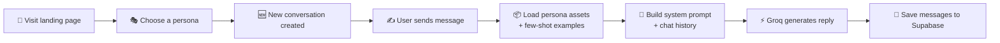

<div align="center">

# 🎭 Persona AI

**Chat with AI personas inspired by real people.**

A polished, full-stack Next.js app combining persona-driven conversations, Supabase-backed storage, and Groq-powered language generation.

[](#)
[](#)
[](#)
[](#)
[](#)
[](#)

</div>

---

## ✨ Overview

Persona AI lets users step into conversation with AI-driven personas modeled after real people. It pairs a clean landing experience with dedicated chat interfaces, giving each persona its own voice — shaped by curated profile data and few-shot examples — while conversations are durably stored and easily retrieved.

| | |
|---|---|
| 🏠 **Landing Page** | Discover and select from featured personas |
| 💬 **Persona Chat** | Dedicated chat sessions per persona |
| 🗄️ **Persistent Storage** | Conversations & messages saved in Supabase |
| 🧠 **Steerable Personality** | Persona assets + few-shot examples shape tone |
| 🔌 **Full CRUD API** | Create, list, fetch, and delete conversations |

---

## 🧰 Tech Stack

| Layer | Technology |
|---|---|
| **Frontend** | Next.js 16 · React 19 · TypeScript |
| **Styling** | Tailwind CSS · shadcn/ui · Framer Motion |
| **Backend / API** | Next.js App Router route handlers |
| **Database** | Supabase |
| **AI Model** | Groq SDK |
| **Extras** | AI SDK · React Markdown · Lucide Icons |

---

## 📁 Project Structure

```text
persona-ai/
├── app/                  # Next.js app router pages and API routes
│   ├── api/              # Conversation, persona, and message endpoints
│   └── chat/             # Persona chat pages
├── components/           # Reusable UI components
├── lib/                  # Shared app logic
│   ├── ai/                # Persona loading, prompt building, and LLM calls
│   └── supabase/          # Supabase client and query helpers
├── public/                # Static assets
└── transcript-generator/  # Optional pipeline for generating persona data from transcripts
```

---

## 🔄 Core User Flow



1. A user visits the landing page and chooses a persona.
2. The app creates a new conversation for that persona.
3. Each message is sent to a Next.js API route.
4. The server loads the selected persona assets and few-shot examples.
5. A system prompt and chat history are built for the LLM.
6. Groq generates the assistant reply.
7. Both user and assistant messages are persisted to Supabase.

---

## 🔌 API Routes

### Persona Routes
| Method | Route | Description |
|---|---|---|
| `GET` | `/api/personas` | Returns the list of available personas from Supabase |

### Conversation Routes
| Method | Route | Description |
|---|---|---|
| `POST` | `/api/conversations` | Creates a new conversation for a persona |
| `GET` | `/api/conversations?persona=slug` | Fetches all conversations for a given persona |
| `DELETE` | `/api/conversations` | Deletes a conversation and its related messages |

### Message Routes
| Method | Route | Description |
|---|---|---|
| `POST` | `/api/conversations/[conversationsId]/messages` | Saves a user message, builds prompt context, calls the LLM, and stores the assistant reply |
| `GET` | `/api/conversations/[conversationsId]/messages` | Retrieves the full message history for a conversation |

---

## 🧠 AI Behavior

Each persona's personality is shaped by dedicated asset files:

```text
lib/ai/personas/[persona]/[persona].persona.json    # Profile & personality traits
lib/ai/personas/[persona]/[persona].fewshots.json   # Few-shot conversation examples
```

The **prompt builder** combines:

- 🧾 A system prompt derived from the persona profile
- 💡 A small set of few-shot examples
- 🗂️ The active conversation history

---

## ⚙️ Environment Variables

Create a `.env.local` file before running the app:

```env
NEXT_PUBLIC_SUPABASE_URL=your_supabase_project_url
NEXT_PUBLIC_SUPABASE_PUBLISHABLE_KEY=your_supabase_publishable_key
GROQ_API_KEY=your_groq_api_key
```

> **Required for:** Supabase database access & LLM inference through Groq.

---

## ✅ Prerequisites

- ✔️ Node.js 20+ recommended
- ✔️ npm
- ✔️ Access to a Supabase project
- ✔️ A Groq API key

---

## 🚀 Running Locally

**1. Install dependencies**
```bash
npm install
```

**2. Start the development server**
```bash
npm run dev
```

**3. Open the app in your browser**
```text
http://localhost:3000
```

---

## 🏗️ Production Build

**Verify the app builds successfully:**
```bash
npm run build
```

**Start the production build locally:**
```bash
npm run start
```

---

<div align="center">

Built with ❤️ using Next.js, Supabase, and Groq

</div>
